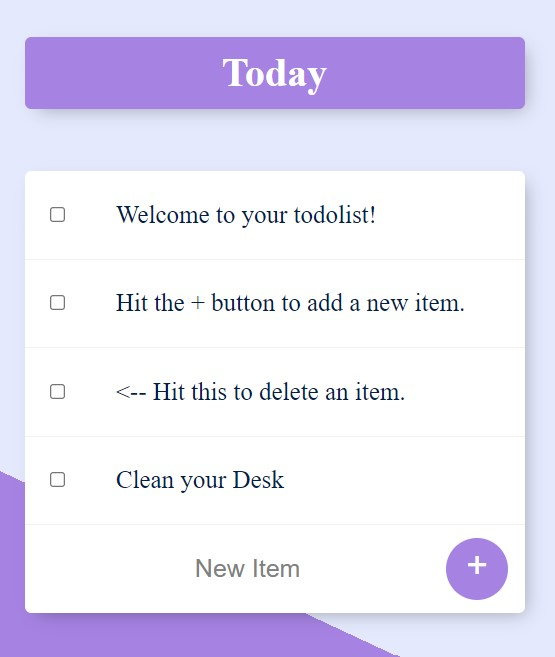
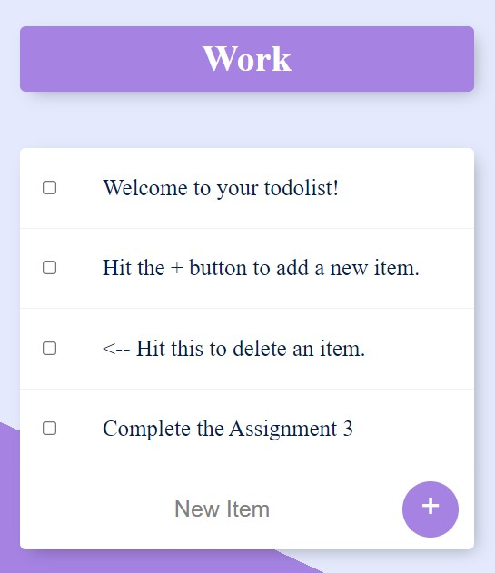

# To-Do-List App
:heavy_check_mark: An application to add the To Do items in a checklist form. The user can also delete the item by just clicking on the checkbox.

# Idea
* It is a well known fact that writing things down in a list helps in better work management
* Making such lists on a paper is a thing of the past
* A Web-based application which allows user to type their list down and delete it when they are done with it

# Tools Used
Used HTML5, CSS3, Bootstrap, Node.js, Express.js, MongoDB (mongoose), EJS template engine, Lodash utility functions and JavaScript

# How to use the application
* The default list comes with a heading called **"Today"**.


* The user can change the heading according to the requirement. **For Example:-** If the user want to use a list for work,  **/Work** can be added as a suffix in the URL.


* An example to open a new To-Do List to add items based on **Work**


* To add an item, the user can click on the placeholder **New Item** and type the item which needs to be added
* After typing it, the user can click on **'+'** button to add it in the list
* When the user is done with the work mentioned in the list or if the user want to delete the item from the list, they can click on the **checkbox** beside that item and the item gets a strikethrough and gets deleted automatically

# Important Note
* The To-Do list app have a default page with **Today** as the title. If the user navigate to **/work** list, the item added in work list won't appear in any other list, say **/shopping** list.
* The item added in a particular list will be persisted when the user navigates to different lists.

# How to Run
* **Download** and **Un-Zip** the file.
* ```cd``` to the location in terminal.
* Execute the command ```npm install``` to install all modules.
* To run the application on port 3000 type ```node app.js```.
* Headover to the browser and go to **http://localhost:3000/**

## Running Test Cases
- Run ```npm run test``` to run the test
